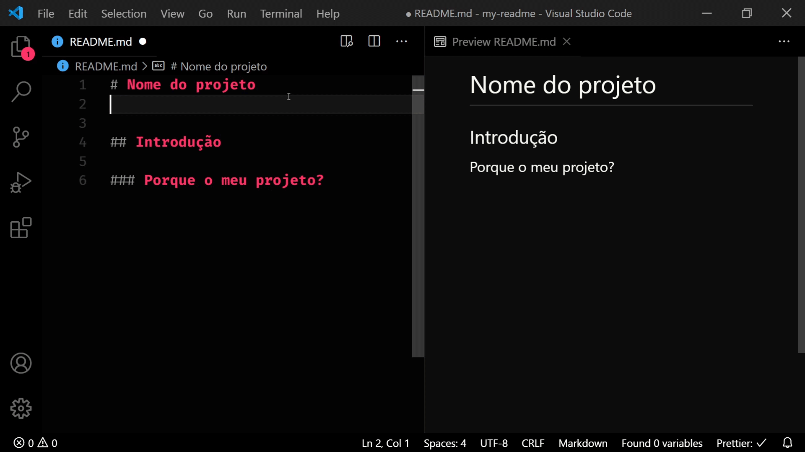

    
    <h2>
        My readme
    </h2>
    Readme padrão para os meus repositórios

 

## Sobre o projeto

Facilitar o desenvolvimento de um readme, de maneira visual e que tenha todos os conteúdos necessários.

## Features

- [x] Hierarquia visual
- [x] Sintaxe markdown
- [x] Organização da documentação
- [x] Utilização das shields
- [ ] Contribuidores automáticos

## Começando

### **Prerequisitos**

- Ter o git instalado
- Instalar a extensão `Markdown All In One` na sua IDE

### **Instalação**

1. Clonar o repositório - `git clone`
2. Abrir o readme
3. Visualizar pela extensão

## Como contribuir

- Abrir uma [issue](https://github.com/rpradosilva/my-readme/issues)
- Depois da issue aceita, mandar uma PR

## Contribuidores

|      [Rafael Prado](http://www.github.com/rpradosilva)       |
| :----------------------------------------------------------: |
|  |

## Licença

[Licença MIT](LICENSE)

---

### Desenvolvido por 
